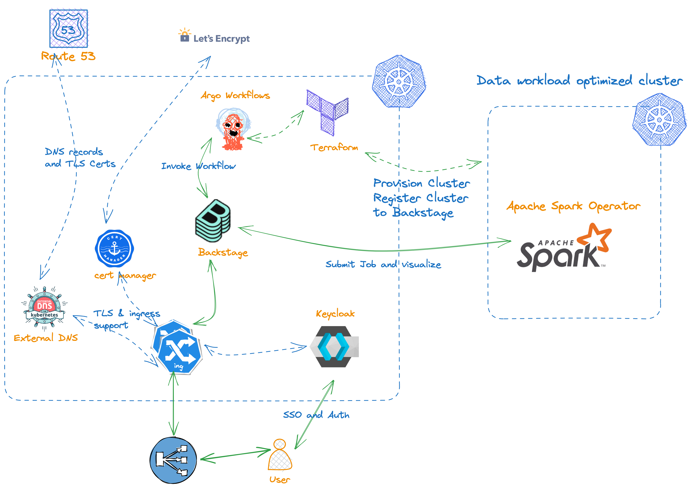
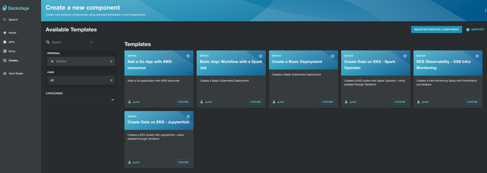
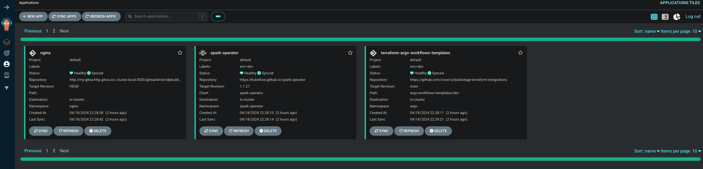

# Backstage Terraform Integrations

💥 Seamlessly use Backstage Terraform Integrations with the rest of the CNOE stack!

> **WORK IN PROGRESS**: *Current the repository is in POC stage. The integrations assume you have enabled Terraform integrations either with the [idpbuilder](https://cnoe.io/docs/reference-implementation/integrations/terraform) or that you have deployed [flux controller](https://github.com/cnoe-io/stacks/blob/main/terraform-integrations/fluxcd.yaml) and [tf-controller](https://github.com/cnoe-io/stacks/blob/main/terraform-integrations/tofu-controller.yaml) on the [Amazon EKS](https://cnoe.io/docs/reference-implementation/installations/app-idp) deployment. We will continuously evolve this to add more more features such as supporting full lifecycle of components such as delete, update etc., and integrate newer AWS maintained terraform based open source solutions in future.*

## 🎯 About



Backstage Terraform integrations serve as a powerful bridge, seamlessly extending the capabilities of cnoe-io's reference implementations, such as [idpbuilder](https://github.com/cnoe-io/idpbuilder) and [reference-implementations-aws](https://github.com/cnoe-io/reference-implementation-aws). This integration enables these reference implementations to harness the full potential of AWS-maintained, Terraform-based open-source solutions, including [data-on-eks](https://github.com/awslabs/data-on-eks) and [aws-observability-accelerator](https://github.com/aws-observability/aws-observability-accelerator).

By leveraging these Terraform integrations, Backstage becomes a versatile platform that can effortlessly incorporate cutting-edge AWS technologies and services. This synergy empowers developers and architects to construct robust, scalable, and highly observable platform templates tailored to their specific needs.

The integration process is a symphony of automation and efficiency. Terraform, with its declarative approach to infrastructure as code, orchestrates the provisioning and configuration of the desired AWS resources. This streamlined process ensures consistency, reproducibility, and adherence to best practices across multiple environments, from development to production.

Moreover, the integration with AWS-maintained open-source solutions brings a wealth of expertise and community-driven innovation to the table. Solutions like data-on-eks and aws-observability-accelerator are meticulously crafted by AWS experts, incorporating industry-leading practices and architectural patterns. By harnessing these solutions, developers can benefit from battle-tested architectures, enhanced security, and optimized performance, all while reducing the time and effort required for implementation.

The seamless integration of Terraform and AWS-maintained open-source solutions within Backstage empowers organizations to unlock new realms of possibilities. Whether it's deploying highly available and scalable data platforms on Amazon Elastic Kubernetes Service (EKS) or implementing comprehensive observability solutions for monitoring, logging, and tracing, Backstage becomes a powerful catalyst for innovation and digital transformation.

With Backstage Terraform integrations, organizations can confidently embrace the latest AWS technologies, accelerate time-to-market, and deliver robust, secure, and highly observable platform templates that drive business value and competitive advantage.

## 🏃‍♀️ Prerequisites

### **Set up a container engine:**

We might need a container engines such as `Docker Desktop`, `Podman` to run backstage terraform integrations locally. Please check [this](https://github.com/cnoe-io/idpbuilder?tab=readme-ov-file#prerequisites) documentation to setup your container engine.

### **Install idpbuilder locally:**

```bash
version=$(curl -Ls -o /dev/null -w %{url_effective} https://github.com/cnoe-io/idpbuilder/releases/latest)
version=${version##*/}
curl -L -o ./idpbuilder.tar.gz "https://github.com/cnoe-io/idpbuilder/releases/download/${version}/idpbuilder-$(uname | awk '{print tolower($0)}')-$(uname -m | sed 's/x86_64/amd64/').tar.gz"

tar xzf idpbuilder.tar.gz

./idpbuilder version
# example output
# idpbuilder 0.4.1 go1.21.5 linux/amd64
```
or use the following installation script:

```bash
curl -fsSL https://raw.githubusercontent.com/cnoe-io/idpbuilder/main/hack/install.sh | bash
```

### **Deploy `idpbuilder` with Terraform integration templates:**

Use the following command to deploy idpbuilder and ensure that the Backstage Terraform integration Argo application is part of your setup.

```bash
idpbuilder create \
  --use-path-routing \
  -p https://github.com/cnoe-io/stacks//ref-implementation \
  -p https://github.com/cnoe-io/stacks//terraform-integrations
```

<details>
<summary> <b>Optional:</b> Add AWS Credentials</summary>

In case of deploying AWS resources, you will need access to your AWS account. You can follow the instructions below, to setup your AWS account with CNOE terraform integrations:

```bash
export AWS_ACCESS_KEY_ID=<FILL THIS>
export AWS_SECRET_ACCESS_KEY=<FILL THIS>
# Optional for IAM roles
export AWS_SESSION_TOKEN=<FILL THIS> 

# AWS Credentials for flux-system Namespace for TOFU Controller
cat << EOF > ./aws-secrets-tofu.yaml
---
apiVersion: v1
kind: Secret
metadata:
  name: aws-credentials
  namespace: flux-system
type: Opaque
stringData:
  AWS_ACCESS_KEY_ID: ${AWS_ACCESS_KEY_ID}
  AWS_SECRET_ACCESS_KEY: ${AWS_SECRET_ACCESS_KEY}
  # Add this only if it's required. Optional for IAM roles
  AWS_SESSION_TOKEN: ${AWS_SESSION_TOKEN}
EOF

kubectl apply -f ./aws-secrets-tofu.yaml

```
</details>

### **Update the Backstage catalog:**

You can optionally install the catalog by adding it to the Backstage config. 

In case of the idpBuilder: 
- clone the [cnoe-io/stacks](https://github.com/cnoe-io/stacks) repository
- navigate to `./ref-implementation/backstage/manifests/install.yaml`
- add the following lines for catalog location under `data."app-config.yaml".catalog.locations`

```yaml
      - type: url
        target: https://github.com/cnoe-io/backstage-terraform-integrations/blob/main/backstage-templates-for-eks/catalog-info.yaml
        rules:
          - allow: [User, Group]

```
Then run the following idpbuilder command to update the components with `path-to-stacks-repo` referring to the location where you cloned the [cnoe-io/stacks](https://github.com/cnoe-io/stacks) repository.

```bash
idpbuilder create \
  --use-path-routing \
  -p [path-to-stacks-repo]/ref-implementation \
  -p https://github.com/cnoe-io/stacks//terraform-integrations
```

Alternatively, you can take the target link above and directly register it as a component with Backstage, and all the respective components in the catalog will appear in the Backstage catalog.

### **Get secrets:**

Run this command to obtain all the credentials needed to log in to Backstage, Argo, etc.

```bash
idpbuilder get secrets
```

### **Verify the WebUI components:**

Use the credentials from the above secrets output.

- Login to Argo: https://cnoe.localtest.me:8443/argocd
- Login to Backstage: https://cnoe.localtest.me:8443/
- Login to Gitea: https://cnoe.localtest.me:8443/gitea


## 🌟 Component delete workflow

Please follow the following steps if you are looking to delete a component created using the backstage terraform integrations. The `Terraform` resources in this repo are configured to clean up the corresponding cloud resources. When the Argo CD application is deleted, the deletion hook for cloud resources kicks in (takes a little bit of time though).

1. In your [argocd](https://cnoe.localtest.me:8443/argocd) console, navigate to your application created for your component and delete it manually.
1. In your [gitea](https://cnoe.localtest.me:8443/gitea/) console, the created repository for your component and delete it manually under settings.
1. Finally in your backstage console, navigate to component and click on `unregister component` to remove the deleted component from backstage.

## 🚀 Backstage and Argo UI

### Backstage environment with terraform templates



### Argo App for Terraform Cluster Workflow Templates



## 🤝 Contributing

If you'd like to contribute to the project or know the architecture and internals of this project, check out the [contribution doc](./CONTRIBUTING.md).

## 🔥 Extending the backstage terraform integrations

We will actively working to evolve this to add more more features such as supporting full lifecycle of components such as delete, update etc., and integrate newer AWS maintained terraform based open source solutions in future.

## 🙌 Community

We welcome all individuals who are enthusiastic about Kubernetes to become a part of this open source solution. Your contributions and participation are invaluable to the success of this project.

## 🙌 Collaboration

If you have any questions or need clarifications on topics covered here, please feel free to reach out to us on the [#cnoe-interest](https://cloud-native.slack.com/archives/C05TN9WFN5S) channel on CNCF Slack.

Built with ❤️.

## 🏆 Support & Feedback
Support is provided on a best effort basis. If you have feedback, feature ideas, or wish to report bugs, please use the [Issues](https://github.com/cnoe-io/backstage-terraform-integrations/issuess) section of this GitHub.
