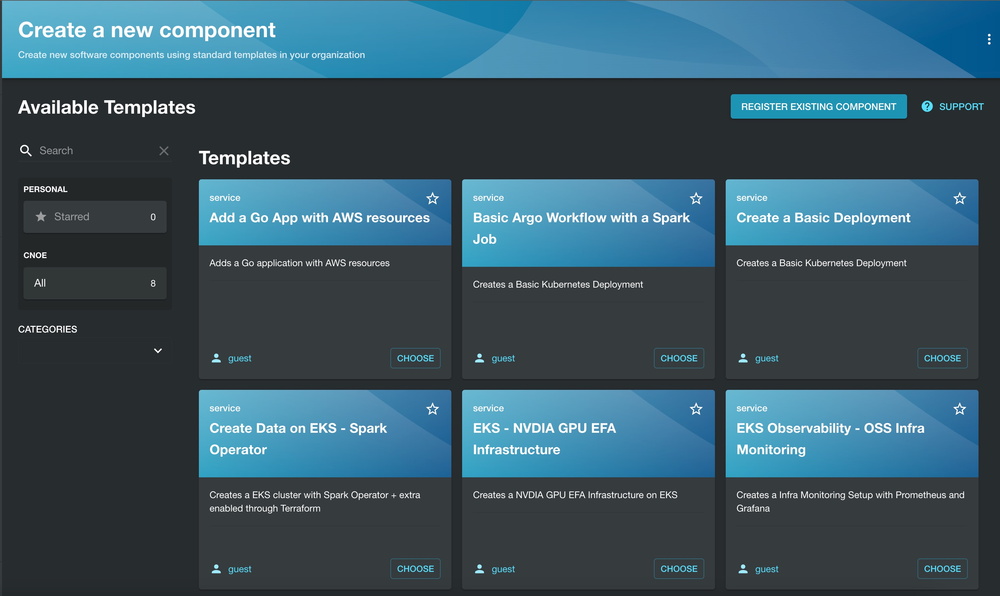
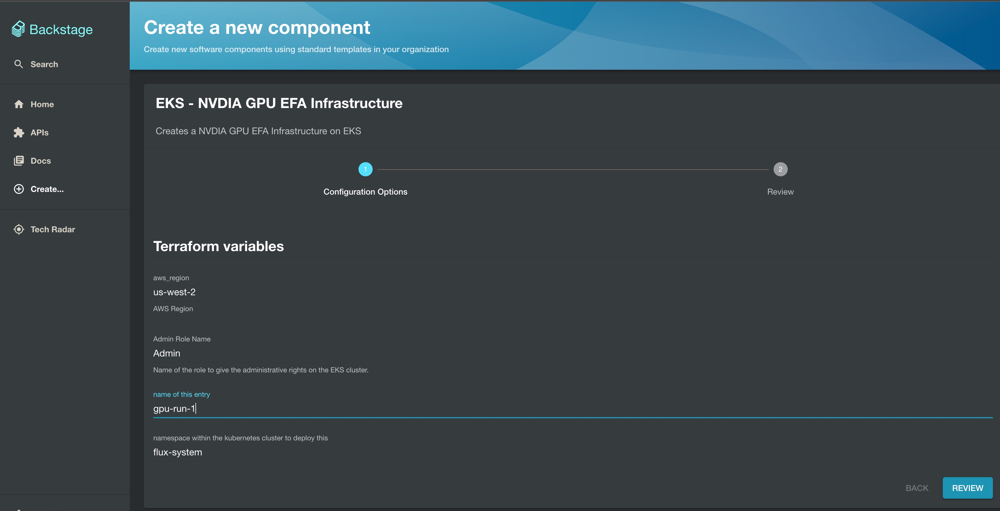
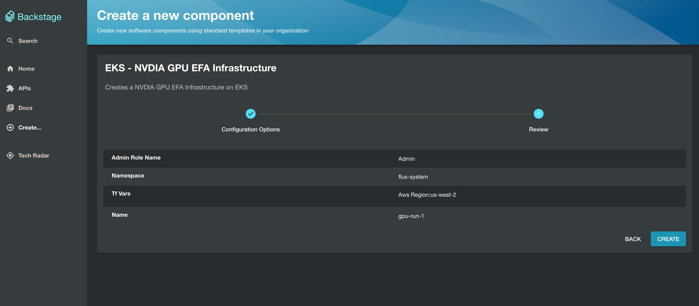
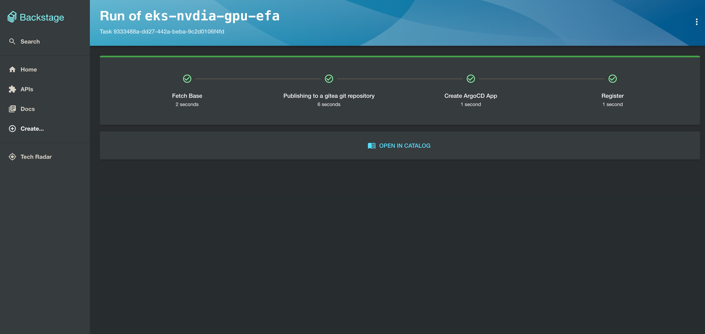
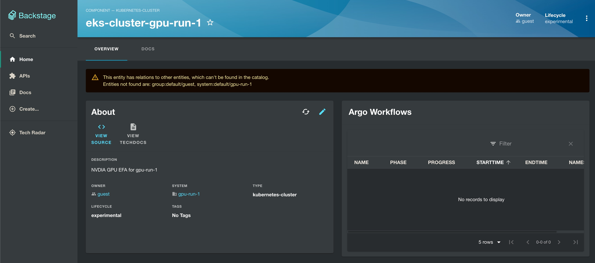
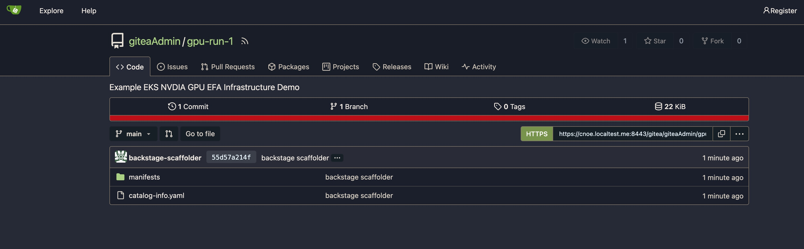
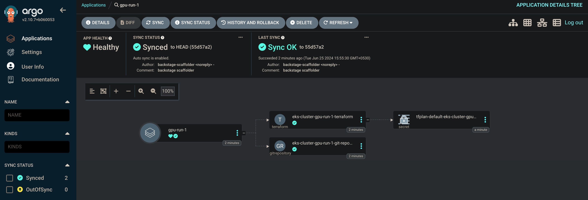
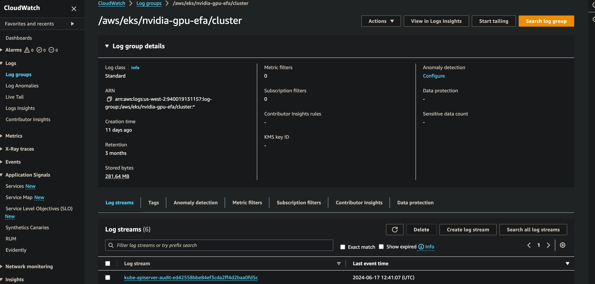

# EKS Cluster w/ NVIDIA GPUs and EFA for Machine Learning

This pattern demonstrates an Amazon EKS Cluster with an EFA-enabled nodegroup that utilizes `p5.48xlarge` instances with H100 NVIDIA GPUs used in distributed, multi-node machine learning workloads.
This pattern implements a terraform integration of AWS-maintained open-source [NVDIA GPU EFA](https://github.com/aws-ia/terraform-aws-eks-blueprints/tree/main/patterns/nvidia-gpu-efa) terraform code in our EKS Terraform Blueprints to deploy them via Backstage. 

The following components are demonstrated in this pattern:

A "default" node group that supports addons and components that do not require GPUs nor EFA devices. Any pods that do not tolerate the taints of the GPU node group will be scheduled on instances within this node group.
A node group of p5.48xlarge instances with
all x32 EFA network interfaces enabled
provisioned within a placement group so that the instances are provisioned close to one another in a single availability zone that supports the instance type.
a common NVIDIA taint of "nvidia.com/gpu:NoSchedule" to ensure only the intended applications are allowed to run on the nodes created
two labels to identify that this nodegroup supports NVIDIA GPUs and EFA devices and allow pods to use node selectors with these labels
the NVME instance store volumes are mounted in a RAID-0 array to provide a single, large, high-performance storage volume for the GPU workloads
kubelet and containerd are configured to utilize the RAID-0 volume, allowing kubelet to discover the additional storage as ephemeral storage that can be utilized by pods
A Helm chart deployment for the NVIDIA device plugin to expose and mount the GPUs provided by the instances to the pods that request them
A Helm chart deployment for the EFA device plugin to expose and mount the EFA network interfaces provided by the instances to the pods that request them. Since the EFA network interfaces are only found on the instances that provide NVIDIA GPUs in this pattern, we do not apply an additional taint for the EFA network interfaces to avoid over-constraining.

## Deployment

Once you are done with setting up [backstage-terraform-integrations](https://github.com/cnoe-io/backstage-terraform-integrations), navigate to [Backstage](https://cnoe.localtest.me:8443/) and click on `create` in the left pane to view the list of available platform templates and click `Choose` on the **EKS - NVIDA GPU EFA Infrastructure** pattern as shown below:



Next, populate the terraform variables for the pattern deployment as shown below and click `Review`:



Next, validate the entered variables in the below confirmation screen and click `Create` :



Next, check on the steps of backstage template run as show below and click `Open In Catalog`:



Next, check on the below screen showing the created Backstage component and click `View Source` to navigate to the Gitea repository:



Next, check on the Gitea repo of the created component as shown below:



Next, Navigate to [ArgoCD](https://cnoe.localtest.me:8443/argocd) console and navigate to Argo App by name `gpu-run-1`to view the below screen:



## Validation

Next, lets validate the execution of the pattern by tofu controller. Run the below command on your terminal to check on `terraforms.infra.contrib.fluxcd.io ` resource:

```bash
> kubectl get terraforms.infra.contrib.fluxcd.io -A

NAMESPACE     NAME                              READY     STATUS     AGE
flux-system   eks-cluster-gpu-run-1-terraform   Unknown   Applying   2m38s
```
Next, lets check on the Kubernetes pod in the `flux-system` namespace which executes the terraform code :

```bash
> kubectl get pods -n flux-system

NAME                                        READY   STATUS    RESTARTS        AGE
eks-cluster-gpu-run-1-terraform-tf-runner   1/1     Running   0               3m3s
source-controller-5cc77697dc-n67pg          1/1     Running   4 (5d20h ago)   11d
tf-controller-865d5c9bbc-sm89l              1/1     Running   4 (5d20h ago)   11d
```

Next, lets check on the logs of this `eks-cluster-gpu-run-1-terraform-tf-runner`as shown below:

```bash
> kubectl logs eks-cluster-gpu-run-1-terraform-tf-runner -n flux-system

Terraform has been successfully initialized!
{"level":"info","ts":"2024-06-25T10:43:53.458Z","logger":"runner.terraform","msg":"workspace select"}
{"level":"info","ts":"2024-06-25T10:43:53.465Z","logger":"runner.terraform","msg":"creating a plan","instance-id":"168115a0-dd43-4957-9d29-67ba85111969"}
{"level":"info","ts":"2024-06-25T10:44:05.284Z","logger":"runner.terraform","msg":"save the plan","instance-id":"168115a0-dd43-4957-9d29-67ba85111969"}
{"level":"info","ts":"2024-06-25T10:44:05.310Z","logger":"runner.terraform","msg":"loading plan from secret","instance-id":"168115a0-dd43-4957-9d29-67ba85111969"}
{"level":"info","ts":"2024-06-25T10:44:05.321Z","logger":"runner.terraform","msg":"running apply","instance-id":"168115a0-dd43-4957-9d29-67ba85111969"}
module.eks.aws_cloudwatch_log_group.this[0]: Creating...
module.eks.module.kms.aws_kms_alias.this["cluster"]: Creating...
```

Lets wait for 20 mins for the `terraform apply` to be completed fully by the tofu controller and lets navigate to Amazon CloudWatch console to view logs from our NVDIA GPU EKS Cluster:



## Delete Workflow

Please follow the following steps if you are looking to delete `gpu-run-1` component created using the backstage terraform integrations. The `Terraform` resources in this repo are configured to clean up the corresponding cloud resources. When the Argo CD application is deleted, the deletion hook for cloud resources kicks in (takes a little bit of time though).

1. In your [argocd](https://cnoe.localtest.me:8443/argocd) console, naviagate to `gpu-run-1` application created for your component and delete it manually.
1. In your [gitea](https://cnoe.localtest.me:8443/gitea/) console, navigate to the `gpu-run-1` repository for your component and delete it manually under settings.
1. Finally in your backstage console, navigate to `gpu-run-1` component and click on `unregister component` to remove the deleted component from backstage.


