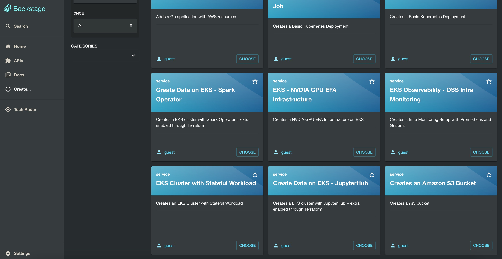
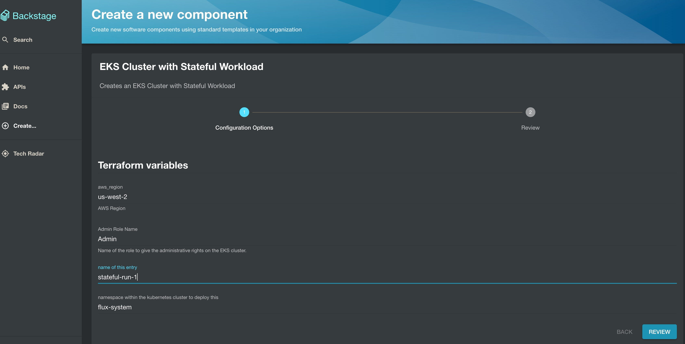
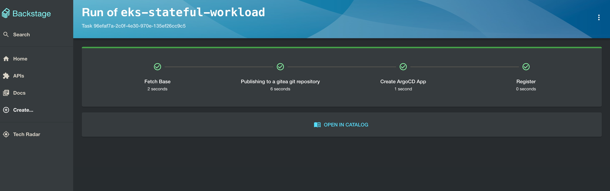
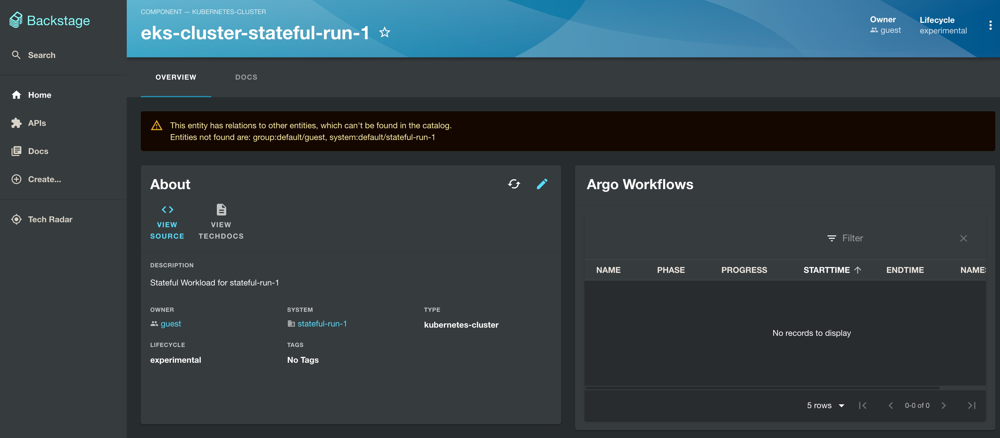
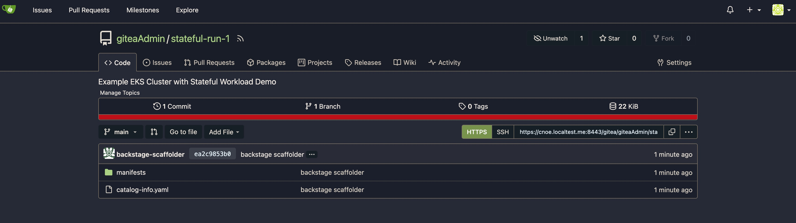
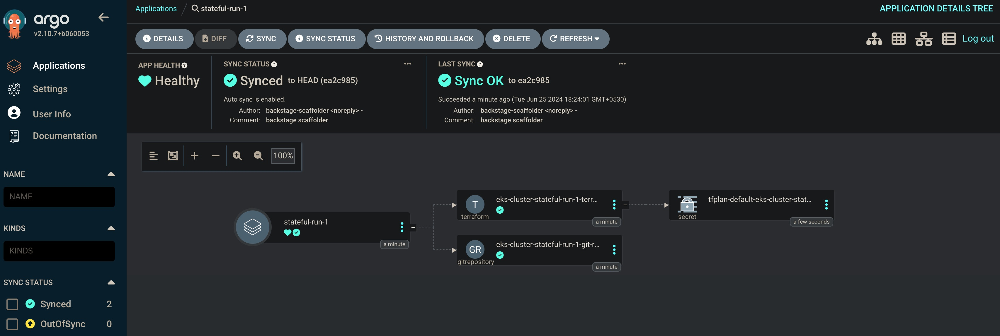
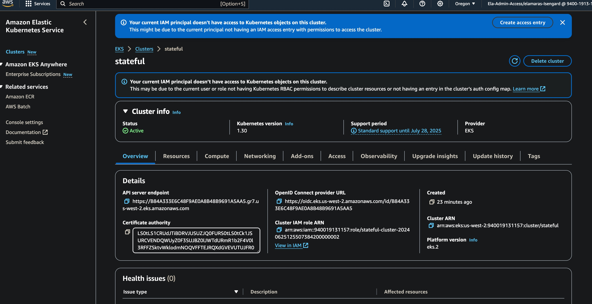

# Amazon EKS Cluster for Stateful Workloads

This pattern implements a terraform integration of AWS-maintained open-source [Stateful Workload](https://github.com/aws-ia/terraform-aws-eks-blueprints/tree/main/patterns/stateful) terraform code in our EKS Terraform Blueprints to deploy them via Backstage.

## Features

Please note: not all of the features listed below are required for stateful workloads on EKS. We are simply grouping together a set of features that are commonly encountered when managing stateful workloads. Users are encouraged to only enable the features that are required for their workload(s) and use case(s).

### [velero](https://github.com/vmware-tanzu/velero)

(From the project documentation)
`velero` (formerly Heptio Ark) gives you tools to back up and restore your Kubernetes cluster resources and persistent volumes. You can run Velero with a public cloud platform or on-premises. Velero lets you:

- Take backups of your cluster and restore in case of loss.
- Migrate cluster resources to other clusters.
- Replicate your production cluster to development and testing clusters.

### EBS & EFS CSI Drivers

- A second storage class for `gp3` backed volumes has been added and made the default over the EKS default `gp2` storage class (`gp2` storage class remains in the cluster for use, but it is no longer the default storage class)
- A standard implementation of the EFS CSI driver

### EKS Managed Nodegroup w/ Multiple Volumes

An EKS managed nodegroup that utilizes multiple EBS volumes. The primary use case demonstrated in this example is a second volume that is dedicated to the `containerd` runtime to ensure the root volume is not filled up nor has its I/O exhausted to ensure the instance does not reach a degraded state. The `containerd` directories are mapped to this volume. You can read more about this recommendation in our [EKS best practices guide](https://aws.github.io/aws-eks-best-practices/scalability/docs/data-plane/#use-multiple-ebs-volumes-for-containers) and refer to the `containerd` [documentation](https://github.com/containerd/containerd/blob/main/docs/ops.md#base-configuration) for more information. The update for `containerd` to use the second volume is managed through the provided user data.

In addition, the following properties are configured on the nodegroup volumes:

- EBS encryption using a customer managed key (CMK)
- Configuring the volumes to use GP3 storage

### EKS Managed Nodegroup w/ Instance Store Volume(s)

An EKS managed nodegroup that utilizes EC2 instances with ephemeral instance store(s). Instance stores are ideal for temporary storage of information that changes frequently, such as buffers, caches, scratch data, and other temporary content, or for data that is replicated across a fleet of instances. You can read more about instance stores in the [AWS documentation](https://docs.aws.amazon.com/AWSEC2/latest/UserGuide/InstanceStorage.html); and be sure to check out the [`Block device mapping instance store caveats`](https://docs.aws.amazon.com/AWSEC2/latest/UserGuide/block-device-mapping-concepts.html#instance-block-device-mapping) section as well which covers why the example has provided user data for mounting the instance store(s). The size and number of instance stores will vary based on the EC2 instance type and class.

In addition, the following properties are configured on the nodegroup volumes:

- EBS encryption using a customer managed key (CMK)
- Configuring the volumes to use GP3 storage

## Deployment

Once you are done with setting up [backstage-terraform-integrations](https://github.com/cnoe-io/backstage-terraform-integrations), navigate to [Backstage](https://cnoe.localtest.me:8443/) and click on `create` in the left pane to view the list of available platform templates and click `Choose` on the **EKS Cluster with Stateful Workload** template as shown below:



Next, populate the terraform variables for the pattern deployment as shown below and click `Review` and `Create`:



Next, check on the steps of backstage template run as show below and click `Open In Catalog`:



Next, check on the below screen showing the created Backstage component and click `View Source` to navigate to the Gitea repository:



Next, check on the Gitea repo of the created component as shown below:



Next, Navigate to [ArgoCD](https://cnoe.localtest.me:8443/argocd) console and navigate to Argo App by name `stateful-run-1`to view the below screen:



## Validation

Next, lets validate the execution of the pattern by tofu controller. Run the below command on your terminal to check on `terraforms.infra.contrib.fluxcd.io ` resource:

```bash
> kubectl get terraforms.infra.contrib.fluxcd.io -A

NAMESPACE     NAME                                   READY     STATUS     AGE
flux-system   eks-cluster-stateful-run-1-terraform   Unknown   Applying   2m6s
```
Next, lets check on the Kubernetes pod in the `flux-system` namespace which executes the terraform code :

```bash
> kubectl get pods -n flux-system

NAME                                             READY   STATUS    RESTARTS        AGE
eks-cluster-stateful-run-1-terraform-tf-runner   1/1     Running   0               2m24s
source-controller-5cc77697dc-n67pg               1/1     Running   4 (5d23h ago)   12d
tf-controller-865d5c9bbc-sm89l                   1/1     Running   4 (5d23h ago)   12d
```

Next, lets check on the logs of this `eks-cluster-stateful-run-1-terraform-tf-runner`as shown below:

```bash
> kubectl logs eks-cluster-stateful-run-1-terraform-tf-runner -n flux-system

2024/06/25 12:54:02 Starting the runner... version  sha
.....

Terraform has created a lock file .terraform.lock.hcl to record the provider
selections it made above. Include this file in your version control repository
so that Terraform can guarantee to make the same selections by default when
you run "terraform init" in the future.

Terraform has been successfully initialized!
{"level":"info","ts":"2024-06-25T12:54:50.286Z","logger":"runner.terraform","msg":"workspace select"}
{"level":"info","ts":"2024-06-25T12:54:50.295Z","logger":"runner.terraform","msg":"creating a plan","instance-id":"793ae859-37cc-4250-81ae-fac33c12ffd2"}
{"level":"info","ts":"2024-06-25T12:55:03.760Z","logger":"runner.terraform","msg":"save the plan","instance-id":"793ae859-37cc-4250-81ae-fac33c12ffd2"}
{"level":"info","ts":"2024-06-25T12:55:03.806Z","logger":"runner.terraform","msg":"loading plan from secret","instance-id":"793ae859-37cc-4250-81ae-fac33c12ffd2"}
{"level":"info","ts":"2024-06-25T12:55:03.829Z","logger":"runner.terraform","msg":"running apply","instance-id":"793ae859-37cc-4250-81ae-fac33c12ffd2"}
module.efs.aws_efs_file_system.this[0]: Creating...
module.eks.aws_cloudwatch_log_group.this[0]: Creating...
module.ebs_csi_driver_irsa.aws_iam_policy.ebs_csi[0]: Creating...
module.velero_backup_s3_bucket.aws_s3_bucket.this[0]: Creating...
module.vpc.aws_vpc.this[0]: Creating...
....
module.vpc.aws_nat_gateway.this[0]: Still creating... [1m10s elapsed]
```

Lets wait for 20 mins for the `terraform apply` to be completed fully by the tofu controller and lets navigate to Amazon EKS console to view the Stateful EKS Cluster:



## Delete Workflow

Please follow the following steps if you are looking to delete `stateful-run-1` component created using the backstage terraform integrations. The `Terraform` resources in this repo are configured to clean up the corresponding cloud resources. When the Argo CD application is deleted, the deletion hook for cloud resources kicks in (takes a little bit of time though).

1. In your [argocd](https://cnoe.localtest.me:8443/argocd) console, naviagate to `stateful-run-1` application created for your component and delete it manually.
1. In your [gitea](https://cnoe.localtest.me:8443/gitea/) console, navigate to the `stateful-run-1` repository for your component and delete it manually under settings.
1. Finally in your backstage console, navigate to `stateful-run-1` component and click on `unregister component` to remove the deleted component from backstage.